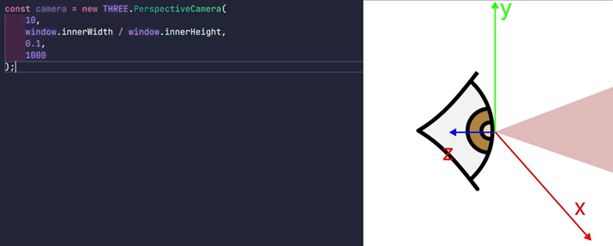

## 3D Animation on scroll with Three JS and GSAP
___

### Lots of diverse 3D models, like the one used in this project, can be found on [SketchFab](https://sketchfab.com/feed)
##### Model should be downloadedn in GLB file version

### Three JS documentation [ThreeJS DOCs](https://threejs.org/docs/index.html#manual/en/introduction/Installation)

#### 3D model should is contained inside of a DIV container with id="container3D"

### THREE JS Camera values

##### first value is viewing angle (increasing or decreasing will make us see more or less things)
##### second value is aspect (ratio of the frame wo contain 3D model)
##### third value is "near" (used to determine the closest distance the camera can see)
##### forth value is "far" (determins the farthest distance the camera can see)

#### Camera setup for our project
